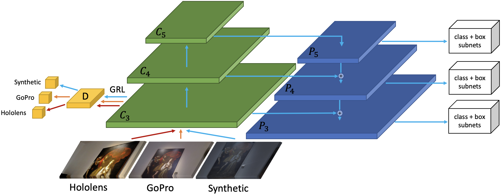
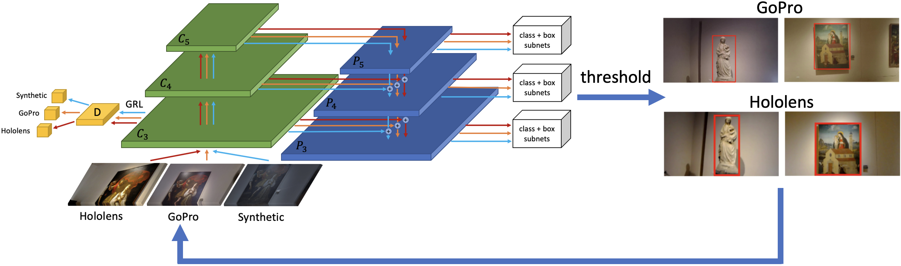

# Detectron2 implementation of STMDA-RetinaNet [Unsupervised Multi Camera Domain Adaptation for Object  Detection in Cultural Sites](https://iplab.dmi.unict.it/OBJ-MDA/)

## Architecture

### Step 1
In this step the models is trained using synthetic labeled images (source domain) and unlabeled real images Hololens and GoPro (target domains). At the end of this step, the model is used to produce pseudo label on both Hololens and GoPro images.  


### Step 2
In this step the model is trained using synthetic labeled images (source domain) and pseudo label real images Hololens and GoPro (target domains) produced in the previous step. This is an iterative step and at the end of each step we produce better pseudo label on the target domains.


## Installation
You can use this repo following one of these three methods:

### Detectron 2 on your PC
Follow the official guide to install [Detectron2 0.2.1](https://github.com/facebookresearch/detectron2/blob/master/INSTALL.md)

### Detectron2 via Dockerfile
Follow these instructions:
```
cd docker/
# Build 
docker build -t detectron2:v0 .

# Launch
docker run --gpus all -it --shm-size=8gb -v /home/yourpath/:/home/yourpath --name=name_container detectron2:v0
```
If you exit from the container you can restart it using:
```
docker start name_container
docker exec -it name_container /bin/bash
```

### Google Colab
Load and run the ```STMDA-RetinaNet.ipynb``` on Google Colab following the instructions inside the notebook.

## Dataset
Dataset is available [here](https://iplab.dmi.unict.it/OBJ-MDA/OBJ_MDA.zip)

### Data Preparation
If you want to use this code with your dataset arrange the dataset in the format of COCO. Inside the script ```stmda_train.py``` register your dataset using: <br> ```register_coco_instances("dataset_name_soruce_training",{},"path_annotations","path_images")```<br>
```register_coco_instances("dataset_name_init_target_training",{},"path_annotations","path_images")```<br>
```register_coco_instances("dataset_name_init_target2_training",{},"path_annotations","path_images")```<br><br>

these are the paths where will be saved the annotations produced at the end of the step 1<br>
```register_coco_instances("dataset_name_target_training",{},"path_annotations","path_images")```<br> 
```register_coco_instances("dataset_name_target2_training",{},"path_annotations","path_images")```<br><br>

```register_coco_instances("dataset_name_target_test",{},"path_annotations","path_images")```<br>
```register_coco_instances("dataset_name_target_test2",{},"path_annotations","path_images")```<br>


### Training
Replace at the following path ```detectron2/modeling/meta_arch/``` the ```retinanet.py``` script with our ```retinanet.py```. <br>
Do the same for the ```fpn.py``` file at the path ```detectron2/modeling/backbone/```, ```evaltuator.py``` and ```coco_evaluation.py``` at ```detectron2/evaluation/```<br>
Inside the script ```stmda_train.py``` you can set the parameters for the second step training like number of iteration and threshold.<br>
Run the script ```stmda_train.py``` <br>
Trained models are available at these links: <br>
[STMDA-RetinaNet]() <br>
[STMDA-RetinaNet-CycleGAN]()

### Testing
If you want to test the model load the new weights, set to 0 the number of iterations and run ```stmda_train.py```

### Results
<p>
  Results of baseline and feature alignment methods. S refers to Synthetic, H refers to Hololens and G to GoPro.
</p>

<table>
  <tr>
    <th>Model</th>
    <th>Source</th>
    <th>Target</th>
    <th>Test H</th>
    <th>Test G</th>
  </tr>
  <tr>
    <td>Faster RCNN</td>
    <td>S</td>
    <td>-</td>
    <td>7.61%</td>
    <td>30.39%</td>
  </tr>
  <tr>
    <td>RetinaNet</td>
    <td>S</td>
    <td>-</td>
    <td>14.10%</td>
    <td>37.13%</td>
  </tr>
  <tr>
    <td><a href="https://openaccess.thecvf.com/content_cvpr_2018/papers/Chen_Domain_Adaptive_Faster_CVPR_2018_paper.pdf">DA-Faster RCNN</a></td>
    <td>S</td>
    <td>H+G merged</td>
    <td>10.53%</td>
    <td>48.23%</td>
  </tr>
  <tr>
    <td><a href= "https://openaccess.thecvf.com/content_CVPR_2019/papers/Saito_Strong-Weak_Distribution_Alignment_for_Adaptive_Object_Detection_CVPR_2019_paper.pdf"> StrongWeak</a></td>
    <td>S</td>
    <td>H+G merged</td>
    <td>26.68%</td>
    <td>48.55%</td>
  </tr>
  <td><a href= "https://arxiv.org/pdf/1911.07158.pdf">CDSSL</a></td>
    <td>S</td>
    <td>H+G merged</td>
    <td>28.66%</td>
    <td>45.33%</td>
  </tr>
  <tr>
    <td><a href="https://www.sciencedirect.com/science/article/pii/S0262885621000032?dgcid=rss_sd_all">DA-RetinaNet</a></td>
    <td>S</td>
    <td>H+G merged</td>
    <td>31.63%</td>
    <td>48.37%</td>
  </tr>
  <tr>
    <td>MDA-RetinaNet</td>
    <td>S</td>
    <td>H, G</td>
    <td>34.97%</td>
    <td>50.81%</td>
  </tr>
  <tr>
    <td>STMDA-RetinaNet</td>
    <td>S</td>
    <td>H, G</td>
    <td>54.36%</td>
    <td>59.51%</td>
  </tr>
</table>
<p>
Results of baseline and feature alignment methods combined with CycleGAN. H refers to Hololens while G to GoPro. "{G, H}" refers to synthetic images translated to the merged Hololens and GoPro domains.
</p>
<table>
  <tr>
    <th>Model</th>
    <th>Source</th>
    <th>Target</th>
    <th>Test H</th>
    <th>Test G</th>
  </tr>
  <tr>
    <td>Faster RCNN</td>
    <td>{G, H}</td>
    <td>-</td>
    <td>15.34%</td>
    <td>63.60%</td>
  </tr>
  <tr>
    <td>RetinaNet</td>
    <td>{G, H}</td>
    <td>-</td>
    <td>31.43%</td>
    <td>69.59%</td>
  </tr>
  <tr>
    <td><a href="https://openaccess.thecvf.com/content_cvpr_2018/papers/Chen_Domain_Adaptive_Faster_CVPR_2018_paper.pdf">DA-Faster RCNN</a></td>
    <td>{G, H}</td>
    <td>H+G merged</td>
    <td>32.13%</td>
    <td>65.19%</td>
  </tr>
  <tr>
    <td><a href= "https://openaccess.thecvf.com/content_CVPR_2019/papers/Saito_Strong-Weak_Distribution_Alignment_for_Adaptive_Object_Detection_CVPR_2019_paper.pdf"> StrongWeak</a></td>
    <td>{G, H}</td>
    <td>H+G merged</td>
    <td>41.11%</td>
    <td>66.45%</td>
  </tr>
  <tr>
    <td><a href="https://www.sciencedirect.com/science/article/pii/S0262885621000032?dgcid=rss_sd_all">DA-RetinaNet</a></td>
    <td>{G, H}</td>
    <td>H+G merged</td>
    <td>52.07%</td>
    <td>71.14%</td>
  </tr>
  <td><a href= "https://arxiv.org/pdf/1911.07158.pdf">CDSSL</a></td>
    <td>{G, H}</td>
    <td>H+G merged</td>
    <td>53.06%</td>
    <td>71.17%</td>
  </tr>
  <tr>
    <td>MDA-RetinaNet</td>
    <td>{G, H}</td>
    <td>H, G</td>
    <td>58.11%</td>
    <td>71.39%</td>
  </tr>
  <tr>
    <td>STMDA-RetinaNet</td>
    <td>{G, H}</td>
    <td>H, G</td>
    <td>66.64%</td>
    <td>72.22%</td>
  </tr>
  
</table>

## Leave a star ⭐ if you use this repository for your project.
<!--```
@inproceedings{pasqualino2021multitarget,
  year = { 2021 },
  booktitle = { International Conference on Image Processing (ICIP) },
  title = { Unsupervised Multi-Target Domain Adaptation for Object Detection },
  author = { Giovanni Pasqualino, Antonino Furnari, Giovanni Maria Farinella },
}
```-->
## Other Works
[DA-RetinaNet](https://github.com/fpv-iplab/DA-RetinaNet) <br>
