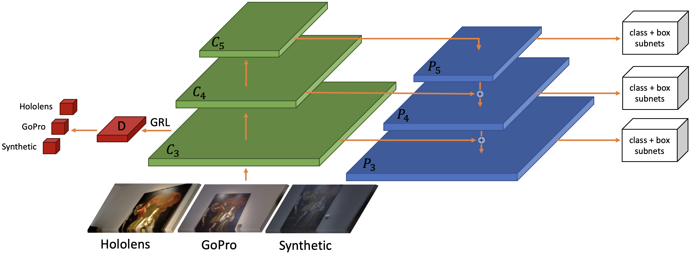

# Detectron2 implementation of MDA-RetinaNet [Unsupervised Multi Target Domain Adaptation For Object Detection](https://iplab.dmi.unict.it/OBJ-MDA/) (submitted to International Conference on Image Processing)


## Introduction
Follow the official guide to install [Detectron2 0.2.1](https://github.com/facebookresearch/detectron2/blob/master/INSTALL.md) on your pc.

### Data Preparation
If you want to use this code with your dataset arrange the dataset in the format of COCO. Inside the script uda_train.py register your dataset using <br> ```register_coco_instances("dataset_name_soruce_training",{},"path_annotations","path_images")```<br>
```register_coco_instances("dataset_name_target_training",{},"path_annotations","path_images")```<br>
```register_coco_instances("dataset_name_target2_training",{},"path_annotations","path_images")```<br>
```register_coco_instances("dataset_name_target_test",{},"path_annotations","path_images")```<br>
```register_coco_instances("dataset_name_target_test2",{},"path_annotations","path_images")```<br>
### Training
Replace at the following path ```detectron2/modeling/meta_arch/``` the retinanet.py script with our retinanet.py. Do the same for the fpn.py file at the path ```detectron2/modeling/backbone/```<br>
Run the script mda_train.py <br>
Trained models are available at these links: <br>
[MDA-RetinaNet](https://iplab.dmi.unict.it/OBJ-MDA/MDA-RetinaNet.pth) <br>
[MDA-RetinaNet-CycleGAN](https://iplab.dmi.unict.it/OBJ-MDA/MDA-RetinaNet-CycleGAN.pth)

### Testing
If you want to test the model load the new weights, set to 0 the number of iterations and run the mda_train.py

### Results
<p>
  Results of baseline and feature alignment methods. S refers to Synthetic, H refers to Hololens and G to GoPro.
</p>

<table>
  <tr>
    <th>Model</th>
    <th>Source</th>
    <th>Target</th>
    <th>Test H</th>
    <th>Test G</th>
  </tr>
  <tr>
    <td>Faster RCNN</td>
    <td>S</td>
    <td>-</td>
    <td>7.61%</td>
    <td>30.39%</td>
  </tr>
  <tr>
    <td>RetinaNet</td>
    <td>S</td>
    <td>-</td>
    <td>14.10%</td>
    <td>37.13%</td>
  </tr>
  <tr>
    <td>DA-Faster RCNN</td>
    <td>S</td>
    <td>H+G merged</td>
    <td>10.53%</td>
    <td>48.23%</td>
  </tr>
  <tr>
    <td>Strong Weak</td>
    <td>S</td>
    <td>H+G merged</td>
    <td>26.68%</td>
    <td>48.55%</td>
  </tr>
  <tr>
    <td>DA-RetinaNet</td>
    <td>S</td>
    <td>H+G merged</td>
    <td>31.63%</td>
    <td>48.37%</td>
  </tr>
  <tr>
    <td>MDA-RetinaNet</td>
    <td>S</td>
    <td>H+G</td>
    <td>34.97%</td>
    <td>50.81%</td>
  </tr>
</table>
<p>
Results of baseline and feature alignment methods combined with CycleGAN. H refers to Hololens while G to GoPro. "{G, H}" refers to synthetic images translated to the merged Hololens and GoPro domains.
</p>
<table>
  <tr>
    <th>Model</th>
    <th>Source</th>
    <th>Target</th>
    <th>Test H</th>
    <th>Test G</th>
  </tr>
  <tr>
    <td>Faster RCNN</td>
    <td>{G, H}</td>
    <td>-</td>
    <td>15.34%</td>
    <td>63.60%</td>
  </tr>
  <tr>
    <td>RetinaNet</td>
    <td>{G, H}</td>
    <td>-</td>
    <td>31.43%</td>
    <td>69.59%</td>
  </tr>
  <tr>
    <td>DA-Faster RCNN</td>
    <td>{G, H}</td>
    <td>H+G merged</td>
    <td>32.13%</td>
    <td>65.19%</td>
  </tr>
  <tr>
    <td>Strong Weak</td>
    <td>{G, H}</td>
    <td>H+G merged</td>
    <td>41.11%</td>
    <td>66.45%</td>
  </tr>
  <tr>
    <td>DA-RetinaNet</td>
    <td>{G, H}</td>
    <td>H+G merged</td>
    <td>52.07%</td>
    <td>71.14%</td>
  </tr>
  <tr>
    <td>MDA-RetinaNet</td>
    <td>{G, H}</td>
    <td>H+G</td>
    <td>58.11%</td>
    <td>71.39%</td>
  </tr>
</table>

<!---## Citation
Please cite the following paper if you use this repository for your project.
```
@inproceedings{pasqualino2021multitarget,
  year = { 2021 },
  booktitle = { International Conference on Image Processing (ICIP) },
  title = { Unsupervised Multi-Target Domain Adaptation for Object Detection },
  author = { Giovanni Pasqualino, Antonino Furnari, Giovanni Maria Farinella },
}
```-->
## Other Works
[DA-RetinaNet](https://github.com/fpv-iplab/DA-RetinaNet)
