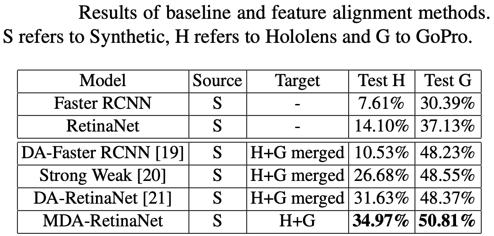
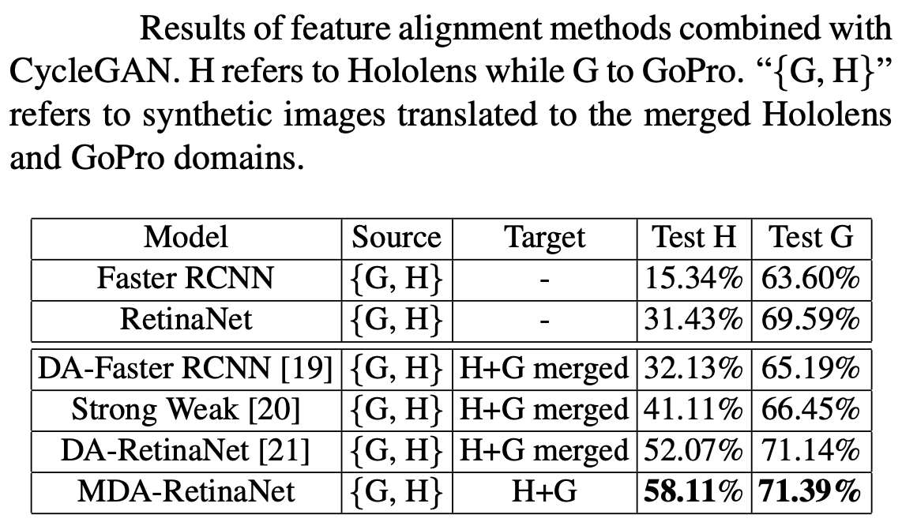

# Detectron2 implementation of MDA-RetinaNet Unsupervised Multi Target Domain Adaptation For Object Detection


## Introduction
Follow the official guide to install [Detectron2 0.2.1](https://github.com/facebookresearch/detectron2/blob/master/INSTALL.md) on your pc.

### Data Preparation
If you want to use this code with your dataset arrange the dataset in the format of COCO. Inside the script uda_train.py register your dataset using <br> ```register_coco_instances("dataset_name_soruce_training",{},"path_annotations","path_images")```<br>
```register_coco_instances("dataset_name_target_training",{},"path_annotations","path_images")```<br>
```register_coco_instances("dataset_name_target2_training",{},"path_annotations","path_images")```<br>
```register_coco_instances("dataset_name_target_test",{},"path_annotations","path_images")```<br>
```register_coco_instances("dataset_name_target_test2",{},"path_annotations","path_images")```<br>
### Training
Replace at the following path ```detectron2/modeling/meta_arch/``` the retinanet.py script with our retinanet.py. Do the same for the fpn.py file at the path ```detectron2/modeling/backbone/```<br>
Run the script train.py

### Testing
If you want to test the model, set to 0 the number of iteration and run the mda_train.py

### Results
<p>

</p>
<p>

</p>

## Citation
Please cite the following paper if you use this repository for your project.
```
@inproceedings{pasqualino2021multitarget,
  year = { 2021 },
  booktitle = { International Conference on Image Processing (ICIP) },
  title = { Unsupervised Multi-Target Domain Adaptation for Object Detection },
  author = { Giovanni Pasqualino, Antonino Furnari, Giovanni Maria Farinella },
}

## Other Works
[DA-RetinaNet](https://github.com/fpv-iplab/DA-RetinaNet)
